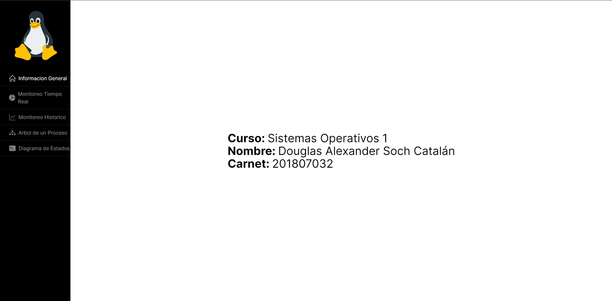
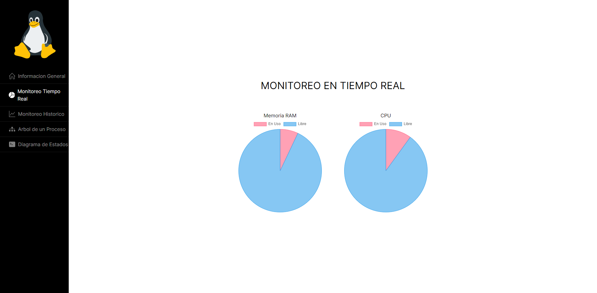
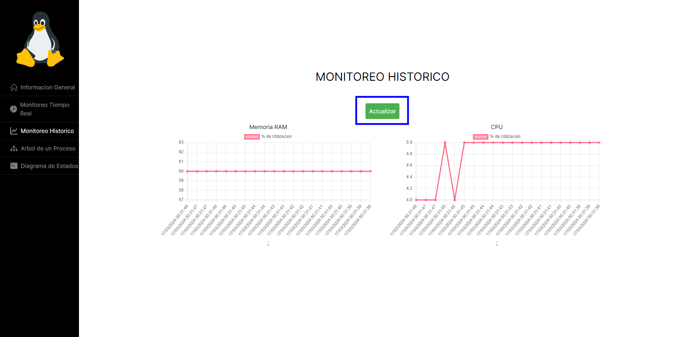
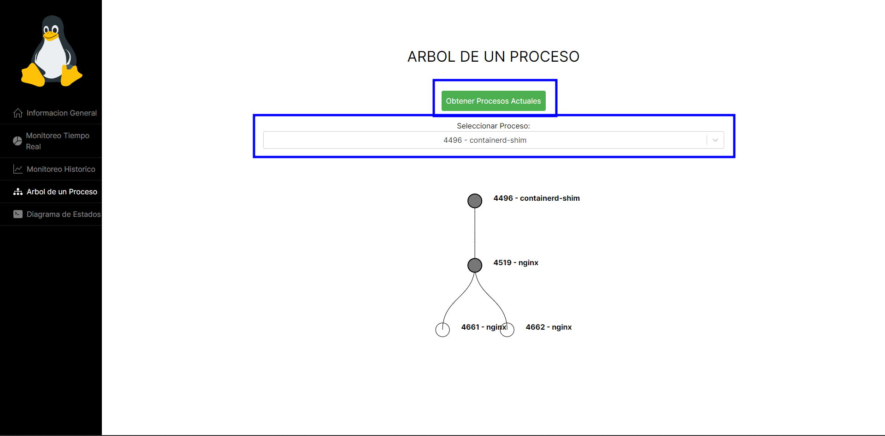
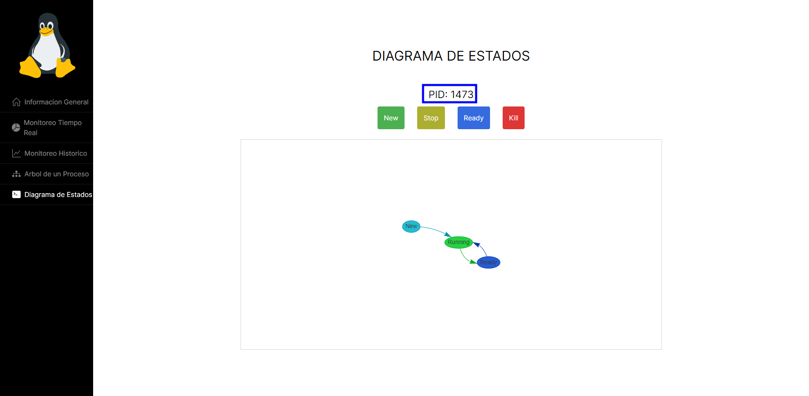
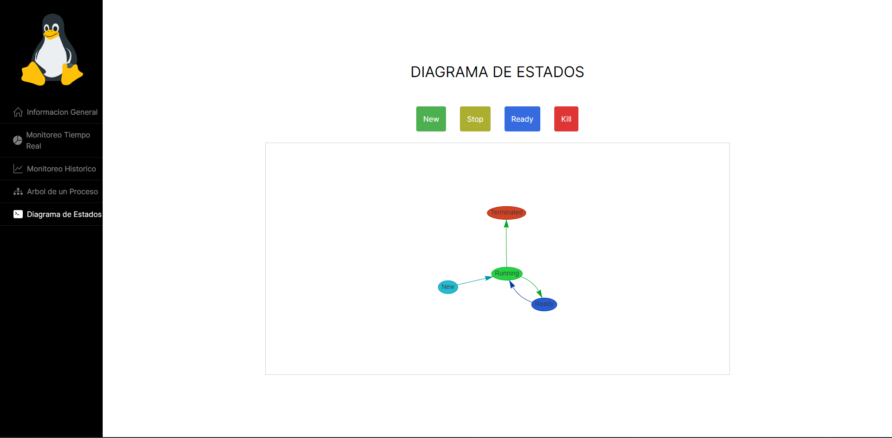
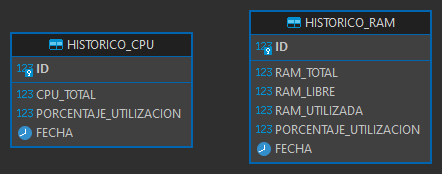

# Monitoreo y Señales de Procesos

_Este es el primer proyecto del curso de Sistemas Operativos 1, el cual se tiene como objetivo principal implementar un sistema de monitoreo de recursos del sistema y gestión de procesos. El sistema resultante permitirá obtener información clave sobre el rendimiento del computador, procesos en ejecución y su administración a través de una interfaz amigable._

<!-- [📑 Enunciado](enunciado.pdf) -->

## 🚀 Comenzando

### 📋 Requerimientos para desarrollo

* [Golang 1.22.0](https://go.dev/dl/)
```console
go version
```

* [Node 20.11.1](https://nodejs.org/en/download/)
```console
node --version
```

* [GCC 11.4.0](https://phoenixnap.com/kb/install-gcc-ubuntu)
```console
gcc --version
```

### 📋 Requerimientos para la ejecución del proyecto

* Docker 25.0.3
```console
docker -v
```

### ⚙️ Ejecución

Dado que los módulos se implementaron en C, se utiliza un Makefile para facilitar la compilación y gestión del proyecto. Para compilar y gestionar los módulos, se recomienda ejecutar el siguiente comando en el directorio 'modulos'

```console
make all
```

> Otros comandos make [aqui](referencia_comandos.md)

Dado que el proyecto se ejecuta a través de Docker, unicamente se debe de realizar el siguiente comando en la raiz del proyecto:

```console
docker compose up
```

## 📖 Documentación

### 💻 Interfaz de usuario

#### Información general
En esta pagina se muestra la información general del desarrollador y curso.



#### Monitoreo en tiempo real
En esta pagina se muestra las siguientes graficas:

* Porcentaje de utilización de la memoria RAM.
* Porcentaje de utilización del CPU.

Estas graficas se van actualizando cada 500 milisegundos.



#### Monitoreo historico
En esta pagina se muestra las siguientes graficas:

* Rendimiento a lo largo del tiempo de la RAM.
* Rendimiento a lo largo del tiempo del CPU.



Para mostrar las graficas, es necesario presionar el boton "Actualizar"

#### Arbol de un proceso
Se detallan todos los procesos que están actualmente en ejecución en el CPU, incluyendo información sobre sus procesos secundarios, en caso de que los tengan.

Para acceder a la lista de procesos, es necesario presionar el botón "Obtener Procesos Actuales". Una vez obtenida la lista, podrás seleccionar el proceso específico que desees visualizar en forma gráfica.



#### Diagrama de estados

Este apartado simulara los estados de los procesos a través de botones, que enviaran las señales KILL a los procesos.

**Estados**

* *New*: El proceso se está creando
* *Running*: Se están ejecutando instrucciones.
* *Waiting*: El proceso está esperando que ocurra algún evento.
* *Ready*: El proceso está esperando ser asignado a un procesador.
* *Terminated*: El proceso ha finalizado su ejecución.

**Botones**
* *New*: Este botón creará un nuevo proceso, debe de retornar el PID de dicho proceso y
generará los siguientes estados: New, Ready y Running.
* *Kill*: Debe de Terminar el Proceso definitivamente. Estado Terminated.
* *Stop*: este botón debe de cambiar el estado de Running a Ready.
* *Resumen*: Este botón debe de cambiar el estado de Ready a Running.

**Estado activo**



**Estado terminado**



### 🔠 Base de Datos

Se han creado únicamente dos tablas en la base de datos para almacenar la información relacionada con el uso de la CPU y la memoria RAM.

Gracias a estas tablas, es posible visualizar la fecha en la que se registró cada entrada histórica.



### 📑 Modulos

### CPU

El módulo de información de la CPU para el kernel de Linux es una herramienta diseñada para recopilar datos relevantes sobre el uso de la CPU y los procesos en ejecución en un sistema operativo Linux. Este módulo se integra con el sistema de archivos /proc para exponer la información recolectada de manera accesible para el usuario del sistema.

**Características Principales:**

* Recopilación de Datos: El módulo recopila información esencial sobre el uso de la CPU, incluyendo el tiempo total de CPU, el tiempo de CPU utilizado por cada proceso, y el porcentaje de uso de la CPU.

* Gestión de Procesos: Proporciona detalles exhaustivos sobre los procesos en ejecución en el sistema, incluyendo su estado actual (ejecución, espera, zombie, etc.), la cantidad de memoria RAM que utilizan, y la relación con sus procesos secundarios.

**Uso del Módulo:**

* Instalación: El módulo puede ser instalado en el kernel de Linux mediante el comando de carga de módulos correspondiente.

* Acceso a la Información: Una vez cargado, el archivo "cpu_so1_1s2024" en el directorio /proc estará disponible para acceder a la información recopilada.

**Compatibilidad:**

El módulo está diseñado para funcionar en sistemas Linux que admiten el sistema de archivos /proc y la lectura de información del kernel.

### RAM

El módulo de información de la RAM para el kernel de Linux es una herramienta diseñada para proporcionar detalles sobre el uso de la memoria RAM en un sistema operativo Linux. Este módulo se integra con el sistema de archivos /proc para exponer la información recopilada de manera accesible para el usuario del sistema.

**Características Principales:**

* Recopilación de Datos: El módulo recopila información esencial sobre el estado de la memoria RAM, incluyendo la cantidad total de memoria, la cantidad utilizada, el porcentaje de uso y la cantidad libre.

* Interfaz Accesible: El módulo crea un archivo en el directorio /proc, llamado "ram_so1_1s2024", a través del cual los usuarios pueden acceder fácilmente a los datos sobre la memoria RAM.

**Uso del Módulo:**

* Instalación: El módulo puede ser instalado en el kernel de Linux mediante el comando de carga de módulos correspondiente.

* Acceso a la Información: Una vez cargado, el archivo "ram_so1_1s2024" en el directorio /proc estará disponible para acceder a la información recopilada sobre la memoria RAM.

**Compatibilidad:**

El módulo está diseñado para funcionar en sistemas Linux que admiten el sistema de archivos /proc y la lectura de información del kernel.