# Sistema distribuido de votaciones

En este proyecto universitario del curso Sistemas Operativos 1

## Introduccion

El principal objetivo de este proyecto es establecer un sistema de votación para un certamen de bandas de música guatemalteca. Se planea dirigir tráfico a través de archivos de votación hacia varios servicios (grpc y wasm) que se encargarán de encolar los datos recibidos. Además, se implementarán consumidores que monitorearán el sistema de colas para transferir los datos a una base de datos en Redis. Estos datos serán visualizados en tiempo real en paneles de control. Asimismo, se utilizará una base de datos MongoDB para almacenar registros, los cuales podrán ser consultados mediante una aplicación web.

## Objetivos

* Implementar un sistema distribuido con microservicios en kubernetes.
* Encolar distintos servicios con sistemas de mensajerías.
* Utilizar Grafana como interfaz gráfica de dashboards.

## Indice

* [Comenzando](#comenzando)
    * [Requerimientos](#requerimientos)
* [Documentacion](#documentacion)
    * [Arquitectura](#arquitectura)
    * [Graficos en Grafana](#graficos-grafana)
    * [Funcionamiento del proyecto](#funcionamiento-proyecto)
    * [Preguntas](#preguntas)
    * [Desplegar proyecto](#desplegar-proyecto)

## ⭐ Comenzando <div id='comenzando'></div>

### 📋 Requerimientos <div id='requerimientos'></div>

* [Python 3.12.0](https://www.python.org/downloads/)

    Python es un lenguaje de programación de alto nivel, interpretado y de propósito general. Destacado por su legibilidad y simplicidad en la sintaxis, permite a los programadores expresar conceptos en menos líneas de código comparado con otros lenguajes. La versión 3.12.0 es la última versión estable, que incluye mejoras en las funcionalidades del lenguaje y correcciones de errores.

    ```console
    python --version
    ```


* [Golang 1.21.6](https://go.dev/doc/install)

    Go, también conocido como Golang, es un lenguaje de programación creado por Google. Es un lenguaje compilado, tipado estáticamente que facilita la construcción de software de manera eficiente y concurrente. La versión 1.21.6 incluye actualizaciones de rendimiento y seguridad, así como nuevas características para mejorar el desarrollo.

    ```console
    go version
    ```

* [GCloudCLI 471.0.0](https://cloud.google.com/sdk?hl=es-419)

    GCloud CLI (Google Cloud Command Line Interface) es una herramienta que permite a los desarrolladores gestionar los recursos de Google Cloud Platform (GCP) desde la línea de comando. Ofrece comandos para desplegar y manejar aplicaciones, manejar almacenamiento en la nube, configurar redes, entre otros. La versión 471.0.0 trae las últimas actualizaciones y características compatibles con GCP.
    ```console
    gcloud version
    ```

#### Paquetes adicionales

* [Protoc](https://www.geeksforgeeks.org/how-to-install-protocol-buffers-on-windows/)

    Protoc es el compilador de Protocol Buffers, un sistema de serialización de datos estructurado desarrollado por Google, usado ampliamente en servicios de comunicación y almacenamiento de datos. Protoc se utiliza para generar código fuente a partir de archivos de definición .proto en varios lenguajes de programación, en este caso es utilizado para una comunicación grpc en golang.

* [gRPC para Golang](https://grpc.io/docs/languages/go/quickstart/)

    gRPC es un marco de trabajo moderno y de alto rendimiento para la comunicación entre servicios, que usa HTTP/2 como protocolo de transporte y Protocol Buffers como mecanismo de serialización. La versión para Golang permite a los desarrolladores de Go construir sistemas distribuidos y escalables de manera eficiente.

* Kubectl

    Kubectl es una herramienta de línea de comando para interactuar con clusters de Kubernetes. Permite a los usuarios desplegar aplicaciones, inspeccionar y manejar recursos del cluster, y ver logs. Es esencial para la gestión de clusters Kubernetes y es mantenido por Google como parte de su conjunto de herramientas de Google Cloud.

    ```console
    gcloud components install kubectl
    ```

## 📖 Documentacion <div id='documentacion'></div>

### 🎡 Arquitectura <div id='arquitectura'></div>

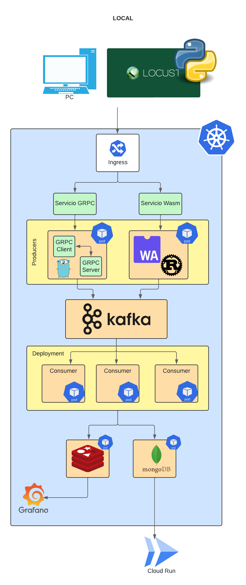

* **PC LOCAL:** Representa la máquina local de un usuario o desarrollador.

* **Locust:** Un software de código abierto para pruebas de carga de sitios web. Se utiliza para simular usuarios y medir el rendimiento de un sistema.

* **Ingress (Kubernetes):** Un controlador de Ingress que gestiona el acceso externo a los servicios en un clúster de Kubernetes, generalmente HTTP.

* **Servicios GRPC y WASM**: Este se encarga de permitir la conexion a los pods desplegados.

* **GRPC Client y Server (dentro del Pod):** Representan la arquitectura cliente-servidor de gRPC dentro de un pod de Kubernetes.

* **Kafka:** Un sistema de mensajería distribuida que se utiliza para construir aplicaciones de transmisión de datos y realizar procesamiento en tiempo real.

* **Consumers (dentro de Deployment):** Procesos que consumen mensajes de Kafka, representados aquí como pods de Kubernetes dentro de una estrategia de despliegue.

* **MongoDB:** Una base de datos NoSQL orientada a documentos utilizada para almacenar datos en un formato flexible. Este se va a encargar de almacenar los logs de los registros que se estan obteniendo de las votaciones.

* **Redis:** Una base de datos en memoria que sirve como estructura de datos y sistema de almacenamiento de caché. En este caso se almacena unicamente como contador de los votos.

* **Grafana:** Una plataforma analítica y de visualización interactiva para monitorear y observar métricas en tiempo real.

* **Cloud Run:** Un servicio de computación sin servidor para contenedores, que permite ejecutar aplicaciones en la infraestructura de la nube.

### 📊 Graficos en Grafana <div id='graficos-grafana'></div>

Para una correcta implementación de Grafana, es crucial asegurarse que esten todas las llaves potenciales. Esto permite que Grafana reconozca cada llave y genere los gráficos necesarios para visualizar adecuadamente los datos gestionados con Redis. Por tanto, al implementar la solución, es necesario agregar las siguientes llaves:

* Madonna:Like a Virgin:1984
* Madonna:Ray of Light:1984
* Pink Floyd:The Dark Side of the Moon:1973
* Pink Floyd:Wish You Were Here:1973
* The Beatles:Sgt. Pepper's Lonely Hearts Club Band:1967
* The Beatles:Abbey Road:1967
* David Bowie:Blackstar:1972
* David Bowie:The Rise and Fall:1972

La forma de crear una llave es la siguiente:

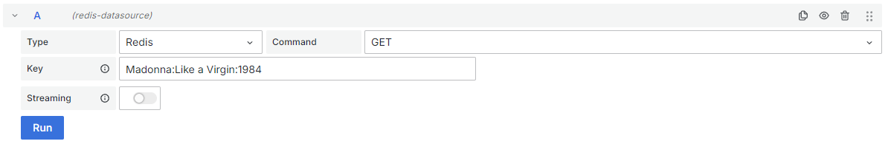

#### Visualización de grafico de barras

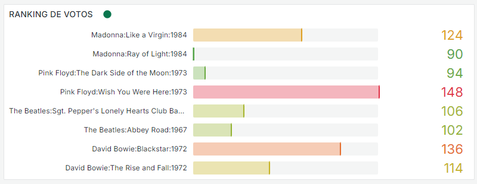

#### Visualización de grafico de pie

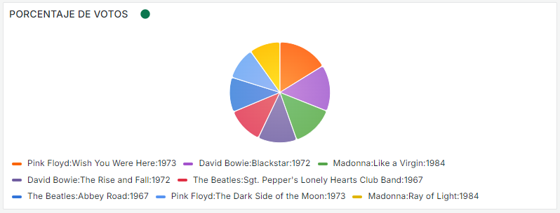

### 🔭 Funcionamiento del Proyecto <div id='funcionamiento-proyecto'></div>

A continuación se presentarán las capturas de pantalla que confirman el correcto funcionamiento según la seccion indicada.

#### Deployments

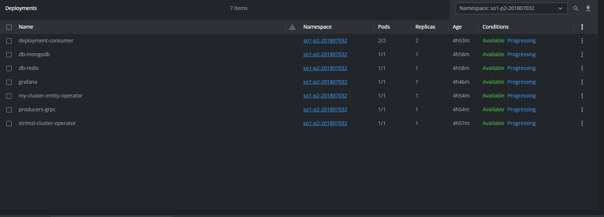

#### Services

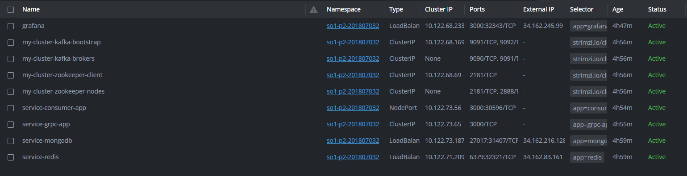

#### Ingress

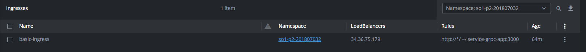

#### Locust

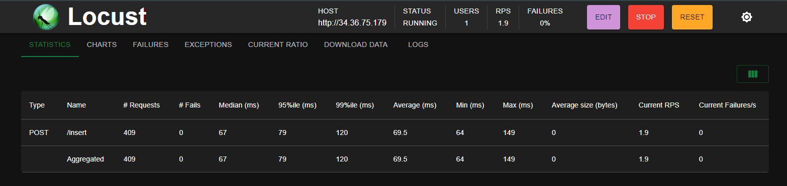

#### GRPC

* Cliente

    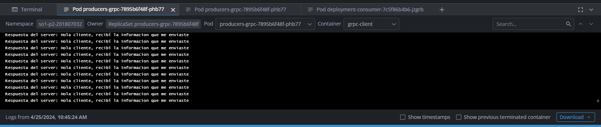

* Servidor

    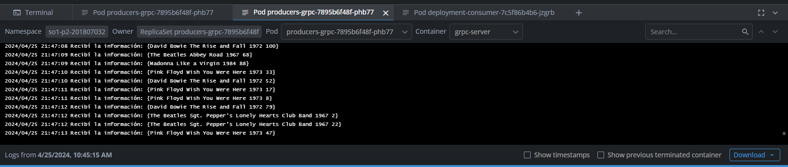

#### Consumer

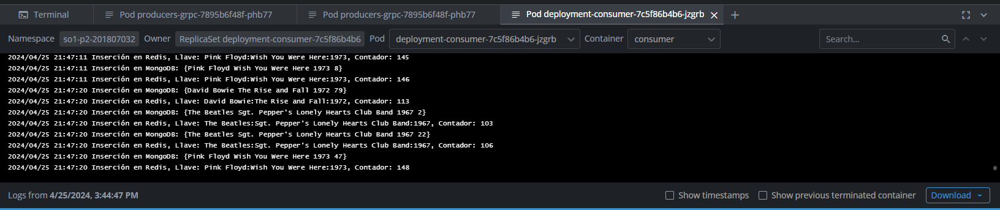

#### MongoDB

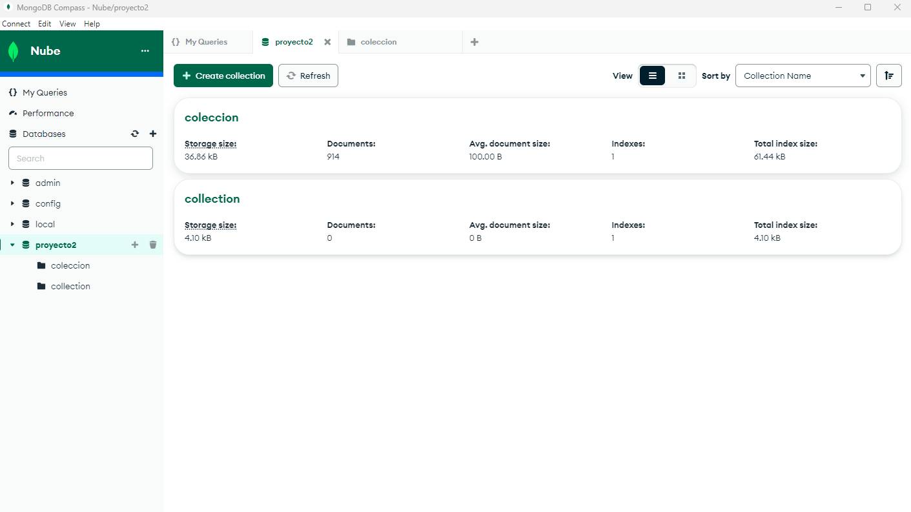

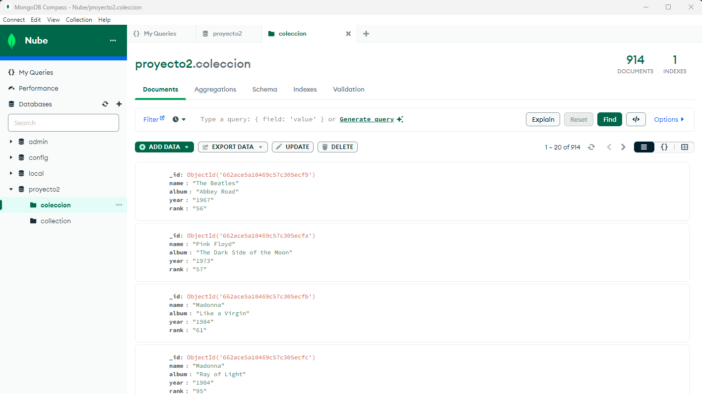

#### Redis

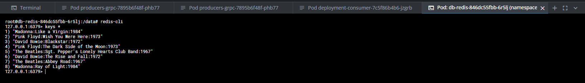

### 📑 Preguntas <div id='preguntas'></div>

### ¿Qué servicio se tardá menos? ¿Por qué?

| GRPC | WebAssembly |
|----------|----------|
| gRPC está optimizado para la comunicación entre servicios en la red, utilizando HTTP/2, que permite conexiones más eficientes y rápidas comparadas con HTTP/1.1. Los mensajes en gRPC son serializados usando Protocol Buffers, que es un método de serialización binario eficiente. Esto significa que, en general, gRPC es rápido para la comunicación inter-servicio, particularmente para APIs donde la eficiencia de la red y el tamaño del mensaje son importantes.    | WebAssembly está diseñado para ejecutarse en un navegador a una velocidad cercana a la del código nativo, lo que le permite realizar cálculos intensivos más rápido que el JavaScript tradicional. Es importante destacar que WebAssembly está pensado para ejecuciones dentro del navegador y puede no estar directamente comparado con gRPC, que es un framework de comunicación entre servicios. |

El rendimiento de un sistema depende del contexto específico del análisis. Por un lado, gRPC destaca en la comunicación eficiente entre servicios, lo que lo convierte en una opción preferida cuando una aplicación necesita interactuar con otras de manera eficaz. Por otro lado, WebAssembly sobresale en la ejecución de código a velocidades superiores a las de JavaScript, lo que sugiere su eficacia predominante en entornos de navegador, en lugar de en escenarios de comunicación inter-servicios.

### ¿En qué casos utilizarías grpc y en qué casos utilizarías wasm?

**Cuándo usar gRPC**

* _Comunicación entre microservicios_: gRPC es muy efectivo para sistemas distribuidos donde requieres una comunicación rápida y eficiente entre servicios, especialmente debido a su uso de HTTP/2.

* _Llamadas a procedimientos remotos_: Es ideal para realizar llamadas entre cliente y servidor, aprovechando la serialización binaria que ofrece Protocol Buffers, lo que lo hace muy rápido y ligero.

* _Plataformas y lenguajes múltiples_: Si tu sistema involucra diferentes lenguajes de programación, gRPC ofrece soporte multiplataforma.

* _Streaming_: gRPC proporciona capacidades de streaming bidireccional.

**Cuándo usar WebAssembly (Wasm)**

* _Ejecución de código en el navegador_: Wasm te permite ejecutar código a nivel de lenguaje ensamblador en el navegador, lo que es útil para tareas que requieren alto rendimiento, como juegos o aplicaciones de edición de imágenes o video.

* _Portabilidad de código existente_: Si quieres llevar una aplicación existente, escrita en un lenguaje como C, C++ o Rust, al navegador sin reescribir completamente el código, Wasm es una excelente opción.

* _Código seguro y sandboxed en el navegador_: Cuando la seguridad es una preocupación, Wasm ejecuta el código en un entorno aislado, lo que proporciona un nivel adicional de seguridad frente a la ejecución de scripts tradicionales.

### 🚀 Desplegar proyecto <div id='desplegar-proyecto'></div>

Dado que las imágenes de cada módulo se encuentran en Docker Hub, solo necesitas ejecutar los manifiestos en el siguiente orden. Asegúrate de que la consola esté ubicada en la ruta raíz de este proyecto antes de proceder.

1. Creación del namespace

    Este comando crea un namespace según se define en el archivo namespace.yaml. Los namespaces son utilizados en Kubernetes para organizar y aislar los recursos dentro del cluster.

    ```console
    kubectl create -f namespace.yaml
    ```

2. Creación del pod de MongoDB

    Este comando despliega un pod que ejecuta MongoDB, utilizando la configuración especificada en mongodb.yaml. MongoDB es una base de datos NoSQL que ofrece alta performance y escalabilidad.

    ```console
    kubectl create -f Database/mongodb.yaml
    ```

3. Creación del pod de Redis

    Con este comando se crea un pod para Redis, según lo definido en redis.yaml. Redis es un almacén de estructura de datos en memoria, utilizado como base de datos, caché y broker de mensajes.

    > Nota: Es necesario agregar un voto a cada álbum y artista. Esto asegura que Grafana pueda visualizar correctamente la información. (Ver sección: **Graficos en Grafana**)

    ```console
    kubectl create -f Database/redis.yaml
    ```

4. Creación de Kafka con Strimzi

    * Creación del operador

        Instala el operador Strimzi en el namespace especificado, lo que permite manejar Kafka dentro del cluster de Kubernetes.

        ```console
        kubectl create -f 'https://strimzi.io/install/latest?namespace=so1-p2-201807032' -n so1-p2-201807032
        ```

    * Creación del volumen

        Aplica una configuración de Kafka con almacenamiento persistente para garantizar que los datos no se pierdan si el pod es reiniciado o reubicado.

        ```console
        kubectl apply -f https://strimzi.io/examples/latest/kafka/kafka-persistent-single.yaml -n so1-p2-201807032
        ```

    * Creación del topic

        Despliega un topic de Kafka específico usando la configuración en topic.yaml.

        ```console
        kubectl create -f Kafka/topic.yaml
        ```

5. Creación del servicio y pod del producer GRPC

    Este comando configura un servicio y un pod para un productor GRPC, que permite la comunicación entre diferentes servicios utilizando el protocolo GRPC.

    ```console
    kubectl create -f Producers/grpc/grpc.yaml
    ```

6. Creación del servicio y pod del producer WASM (No realizado)

    > Este ítem está pendiente y no se ha proporcionado el comando correspondiente para su implementación.
    <!-- ```console
    ``` -->

7. Creación del servicio y pods del deployment consumer

    Despliega un conjunto de pods que funcionan como consumidores de datos. Estos deben estar correctamente configurados para conectarse a las bases de datos MongoDB y Redis.

    > Nota 1: Recuerda crear la base de datos y la colección en MongoDB

    > Nota 2: Recuerda ajustar la variable de entorno **MONGO_HOST** con la dirección IP del servicio de MongoDB, así como la variable **REDIS_ADDR** con la dirección IP del servicio de Redis.

    ```console
    kubectl create -f Deployment/deployment.yaml
    ```

8. Creación del Horizontal Pod Autoscaler (HPA)

    Este comando crea un autoscaler horizontal para los pods, permitiendo que el número de replicas se ajuste automáticamente basado en la carga de trabajo.

    ```console
    kubectl create -f Deployment/hpa-deployment.yaml
    ```

9. Implementacion de Grafana

    Implementa Grafana utilizando el archivo grafana.yaml, permitiendo la visualización y análisis de métricas del sistema y aplicaciones.

    ```console
    kubectl create -f Grafana/grafana.yaml
    ```

10. Creación de Ingress

    Este comando configura un Ingress, que es un API Object que maneja el acceso externo a los servicios en un cluster, típicamente HTTP.

    ```console
    kubectl create -f Ingress/ingress.yaml
    ```
