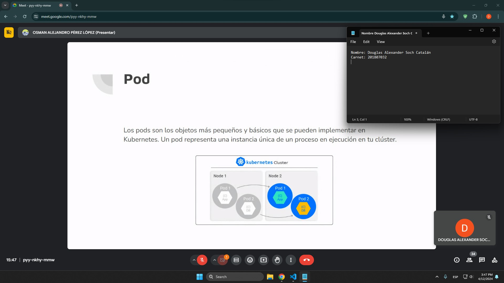
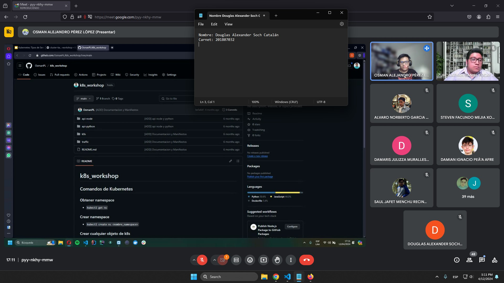

**Nombre**: Douglas Alexander Soch Catalán

**Carnet**: 201807032

# Kubernetes

## Introducción

Kubernetes es un pilar fundamental para la gestión y orquestación de contenedores. Este proporciona un marco robusto para automatirzar el despliegue, el escalado y la gestión de aplicaciones contenerizadas en entornos dinámicos. Además, la capacidad de Kubernetes para integrar y gestionar diversos servicios es crucial en el panorama actual de la informática en la nube. En este ensayo, exploraremos dos aspectos importantes de Kubernetes: los tipos de servicios que ofrece y la integración de Kafka con Strimzi.

## Tipos de Servicios en Kubernetes

Kubernetes ofrece varios tipos de servicios para exponer aplicaciones y permitir la comunicación entre ellas. Estos servicios facilitan la conectividad y la escalabilidad de las aplicaciones desplegadas en un clúster de Kubernetes. Los tipos de servicios más comunes son:

1. **Service ClusterIP**: Este tipo de servicio crea una dirección IP interna única que permite la comunicación entre diferentes servicios dentro del mismo clúster de Kubernetes. Es ideal para la comunicación interna y no se expone externamente fuera del clúster.

2. **Service NodePort**: Con este tipo de servicio, se asigna un puerto específico en cada nodo del clúster de Kubernetes. Esto permite acceder al servicio desde fuera del clúster a través de la dirección IP del nodo y el puerto asignado. Es útil cuando se necesita acceder a un servicio desde fuera del clúster, pero no es adecuado para entornos de producción debido a posibles problemas de seguridad y escalabilidad.

3. **Service LoadBalancer**: Este tipo de servicio utiliza un balanceador de carga externo para distribuir el tráfico entre los pods de un servicio. Proporciona una dirección IP única y pública a través de la cual se puede acceder al servicio desde fuera del clúster. Es especialmente útil en entornos de producción donde se necesita alta disponibilidad y escalabilidad.

## Integración de Kafka con Strimzi en Kubernetes

Kafka es una plataforma de transmisión de datos distribuida que proporciona una arquitectura escalable y de alto rendimiento para la transmisión de mensajes en tiempo real. Strimzi es un operador de Kubernetes que facilita la implementación y gestión de clústeres de Kafka en entornos de Kubernetes.

La integración de Kafka con Strimzi en Kubernetes ofrece varias ventajas:

1. **Despliegue Simplificado**: Strimzi simplifica el proceso de despliegue de clústeres de Kafka en Kubernetes al proporcionar recursos preconfigurados y gestionados como recursos nativos de Kubernetes.

2. **Escalabilidad**: Kubernetes proporciona capacidades de escalabilidad automática que se pueden aprovechar para escalar los clústeres de Kafka según las necesidades de la carga de trabajo.

3. **Gestión Centralizada**: Con Kubernetes, la gestión centralizada de clústeres de Kafka se vuelve más sencilla. Los operadores de Kubernetes, como Strimzi, permiten administrar y supervisar todos los aspectos del clúster desde una única interfaz.

4. **Resiliencia y Alta Disponibilidad**: Kubernetes ofrece capacidades integradas de resiliencia y alta disponibilidad que se pueden aprovechar para garantizar la disponibilidad continua de los clústeres de Kafka incluso en caso de fallos de hardware o software.

### Comandos para desplegar Kafka con Strimzi

1. Creación del operador

    ```console
    kubectl create -f 'https://strimzi.io/install/latest?namespace=so1-p2-201807032' -n so1-p2-201807032
    ```

2. Creación del volumen

    ```console
    kubectl apply -f https://strimzi.io/examples/latest/kafka/kafka-persistent-single.yaml -n so1-p2-201807032
    ```

## Conclusiones

Kubernetes es una herramienta poderosa para la orquestación y gestión de contenedores en entornos de computación en la nube. Su capacidad para integrar y gestionar diversos tipos de servicios, junto con la facilidad de integración con herramientas como Kafka a través de operadores como Strimzi, lo convierte en una opción atractiva para implementar y escalar aplicaciones en entornos modernos.

## Capturas de la conferencia

### Al principio




### Al final


